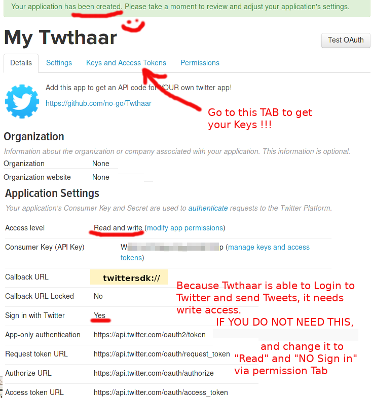

# Read-o-Tweet (Twthaar)

**You became hooked on social media and Twitter? If you wanna change it, try this App.**

Twthaar WAS a very low level twitter client. You can use the old code for build your own cool client or to learn how *Twitter Kit* and API works.

[Twthaar Website](https://no-go.github.io/Twthaar/)

## Features

 -  It is **free of ads**
 -  reduce addiction to **retweet, like or high resolution selfies**, because **it has not** this features!
 -  fast and efficient
 -  tap on the Tweet text to load the full imageful Tweet View
 -  get and add your own API key and secret on apps.twitter.com to authorize the App
 -  lists timeline without images of a given username (+time, likes, retweets)
 -  Browse timelines
     -  extracts username from `RT @username:` and got to that user timeline by a single click
     -  if it is not a retweet, it try to extract the first `@username`
     -  if there is no `@username`, it uses the username of the posting user / publisher
 -  multi search (comma separated) for `@userTimelines` or `#otherStuff`
 -  switch images on/off in preferences
 -  english and german interface
 -  night mode
 -  it is possible to send text only or low resolution picture tweets (you get a login dialog on first try)
 -  if you are logged in, it gets your friend list and add it to the preferences automaticaly (and yourself)
 -  com.twitter.tweet-composer added and modified with stupid Validator, **280 characters** are possible, now.

## Social Media Detoxification

 -  no private messages
 -  no profile changes
 -  no high resolution photo or images sending
 -  no Tweet details, answering, comments
 -  no voting
 -  no stories
 -  no likes
 -  no retweets
 -  no ads
 -  no file or contacts access and full & maximal privacy
 -  not easy to install (you need to get API Key and secret)
 -  no woman, no cry (maybe)
 -  and many other features, which I will never implement ever!

## Get the App

You can get a signed APK from here (Android 4.1+): [APK](https://raw.githubusercontent.com/no-go/Twthaar/master/app/app-release.apk)

## Screenshots

Some screenshots are realy old and the App looks a bit cooler today.

## How to get API Codes

I did not share me API Key and Secret ! You have to create your own. Normaly
all twitter client request go to a man in the middle app-server to analyse
and cache every request (similar to a proxy). WE DO NOT WANT this man in the
middle server, who holds API Key and Secret and sending Ad's or do things with
our private stuff. Thus: Your client have to hold this Keys and you have
to generate your own, because there are request limits to pretent the
original twitter servers from to many requests.

To get API Key and Secret you have to create a new App on the twitter development website.

### Visit apps develop website

[https://apps.twitter.com](https://apps.twitter.com)

### login to twitter or create new twitter account

### after login go back to apps website

### Create new App

### Fill in some defaults

### Check settings of your App

### Switch to the Key and Secret Tab

## License

This is free and unencumbered software released into the public domain.

Anyone is free to copy, modify, publish, use, compile, sell, or distribute this software, either in source code form or as a compiled binary, for any purpose, commercial or non-commercial, and by any means.

In jurisdictions that recognize copyright laws, the author or authors of this software dedicate any and all copyright interest in the software to the public domain. We make this dedication for the benefit of the public at large and to the detriment of our heirs and successors. We intend this dedication to be an overt act of relinquishment in perpetuity of all present and future rights to this software under copyright law.

THE SOFTWARE IS PROVIDED "AS IS", WITHOUT WARRANTY OF ANY KIND, EXPRESS OR IMPLIED, INCLUDING BUT NOT LIMITED TO THE WARRANTIES OF MERCHANTABILITY, FITNESS FOR A PARTICULAR PURPOSE AND NONINFRINGEMENT. IN NO EVENT SHALL THE AUTHORS BE LIABLE FOR ANY CLAIM, DAMAGES OR OTHER LIABILITY, WHETHER IN AN ACTION OF CONTRACT, TORT OR OTHERWISE, ARISING FROM, OUT OF OR IN CONNECTION WITH THE SOFTWARE OR THE USE OR OTHER DEALINGS IN THE SOFTWARE.

For more information, please refer to [http://unlicense.org](http://unlicense.org)

## Privacy Policy

### Personal information.

Personal information is data that can be used to uniquely identify or contact a single person. I DO NOT collect, transmit, store or use any personal information while you use this app.

### Non-Personal information.

I DO NOT collect non-personal information like user's behavior:

 -  to solve App problems
 -  to show personalized ads

The google play store collect non-personal information such as the data of install (country and equipment). 

### Twitter Kit and Twitter API

I use both to build the app. I did not add any google or ad keys or codes for marketing feedback, Ads or payment systems. BUT PLEASE read the *Privacy Policy* of the twitter API, too!

[https://dev.twitter.com/overview/terms/agreement-and-policy](https://dev.twitter.com/overview/terms/agreement-and-policy)

### Privacy Questions.

If you have any questions or concerns about my Privacy Policy or data processing, please contact me.
